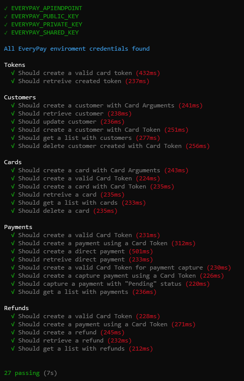

# EveryPay Gateway REST API ES6 Bindings

This is an **UNOFFICIAL** Javascript ES6 library for binding [EveryPay](https://www.everypay.gr/) payments gateway [REST API](https://www.everypay.gr/api-reference/). **By using this software you agree that the author has no responsibility of any issues, bugs, malfunctions or side-effects that may occur by using any piece of code included in this library**.

This library is for server side usage. **You must NEVER use or expose Private Key in client side**. The only functions that can be used in client side using a **Public Key**, are when you need to create / retreive a token using `createToken` / `retreiveToken`.

Minimum requirement of **NodeJS 10**. It can also be compiled using [Babel](https://babeljs.io/) or directly use in [React Native](https://facebook.github.io/react-native/). It utilizes the `fetch` [Web API](https://developer.mozilla.org/en-US/docs/Web/API/Fetch_API) and uses `window.fetch` for Web, `global.fetch` for React Native, [`node-fetch`](https://www.npmjs.com/package/node-fetch) for NodeJS or fallback if there is no native `fetch` support.

You can find full [API Documentation](docs/API.md) and [Testing instructions](docs/Testing.md).

<a name="installation"></a>
## Installation

NPM:<br>
`npm install @lytrax/everypay --save`<br><br>
Yarn:<br>
`yarn add @lytrax/everypay`

### API Keys

Use environment variables to setup your gateway account credentials. There is an `.env.example` file you can check and copy. You can use [`dotenv`](https://www.npmjs.com/package/dotenv) package to auto load project root `.env` files. The library expects the following environment variables to be present:

```bash
EVERYPAY_APIENDPOINT="https://sandbox-api.everypay.gr"
EVERYPAY_PUBLIC_KEY="pk_..."
EVERYPAY_PRIVATE_KEY="sk_..."
EVERYPAY_SHARED_KEY="sh_..."
```

For [Firebase](https://firebase.google.com/), you can use [Firebase CLI](https://firebase.google.com/docs/cli/#functions-commands) to set environment configuration:

```
firebase functions:config:set \
everypay_sandbox_public_key="pk_..." \
everypay_sandbox_private_key="sk_..." \
everypay_sandbox_shared_key="sh_..."
```

and then use functions config to initialize node process environment variables:

```js
process.env['EVERYPAY_APIENDPOINT'] = 'https://sandbox-api.everypay.gr';
process.env['EVERYPAY_PUBLIC_KEY'] = functions.config().everypay_sandbox_public_key;
process.env['EVERYPAY_PRIVATE_KEY'] = functions.config().everypay_sandbox_private_key;
process.env['EVERYPAY_SHARED_KEY'] = functions.config().everypay_sandbox_shared_key;
```

<a name="usage"></a>
## Usage

### [API Documentation](docs/API.md)

Every function returns a [Promise](https://developer.mozilla.org/en-US/docs/Web/JavaScript/Reference/Global_Objects/Promise) that can be either success with a result or fail with an error. When it fails, if the error contains an `endPointError` property, then that reflects an error at the gateway endpoint. You can find the endpoint error structure at the [EveryPay API Reference Errors](https://www.everypay.gr/api-reference/#errors).

Every function can take an optional custom endpoint URL and/or endpoint key to use. When these parameters are omitted, default environment variables are used for all keys and endpoint URL. This can be usefull when creating tokens at the client and we receive the public key dynamically:

```Js
createToken({
  // Will use EVERYPAY_APIENDPOINT environment variable when omitted
  endPointURL: 'https://api.everypay.gr',
  // Will use EVERYPAY_PUBLIC_KEY environment variable when omitted
  endPointKey: 'pk_...',
  ...
})
```

### Create token example

```Js
import { createToken } from '@lytrax/everypay/Tokens';

// This should be called at the client

createToken({
  card_number: '5217925525906273',
  expiration_year: '2022',
  expiration_month: '05',
  cvv: '343',
  holder_name: 'John Doe'
})
.then(token => {
  // Success: Store or use the token
  // ...
})
.catch(error => {
  if('endPointError' in error) {
    // Handle EveryPay API error
  } else {
    // Handle other code error
  }
});
```

### Create customer using token example (using async/await)

```Js
import { createCustomer } from '@lytrax/everypay/Customers';

async function myFlow({
  tokenId: token,
  customerDescription: description,
  customerName: full_name,
  customerEmail: email
}) {
  try {
    const customer = await createCustomer({
      token,
      description,
      full_name,
      email
    });

    // Success: Use the customer object
    // ...
  } catch(error) {
    if('endPointError' in error) {
      // Handle EveryPay API error
    } else {
      // Handle other code error
    }
  }
}
```

<a name="testing"></a>
## Testing

### [Testing instructions](docs/Testing.md)

All API bindings are fully tested:




<a name="license"></a>
## License
MIT License

Copyright (c) Christos Lytras &lt;christos.lytras@gmail.com&gt; (lytrax.io)

Permission is hereby granted, free of charge, to any person obtaining a copy of this software and associated documentation files (the "Software"), to deal in the Software without restriction, including without limitation the rights to use, copy, modify, merge, publish, distribute, sublicense, and/or sell copies of the Software, and to permit persons to whom the Software is furnished to do so, subject to the following conditions:

The above copyright notice and this permission notice shall be included in all copies or substantial portions of the Software.

THE SOFTWARE IS PROVIDED "AS IS", WITHOUT WARRANTY OF ANY KIND, EXPRESS OR IMPLIED, INCLUDING BUT NOT LIMITED TO THE WARRANTIES OF MERCHANTABILITY, FITNESS FOR A PARTICULAR PURPOSE AND NONINFRINGEMENT. IN NO EVENT SHALL THE AUTHORS OR COPYRIGHT HOLDERS BE LIABLE FOR ANY CLAIM, DAMAGES OR OTHER LIABILITY, WHETHER IN AN ACTION OF CONTRACT, TORT OR OTHERWISE, ARISING FROM, OUT OF OR IN CONNECTION WITH THE SOFTWARE OR THE USE OR OTHER DEALINGS IN THE SOFTWARE.
