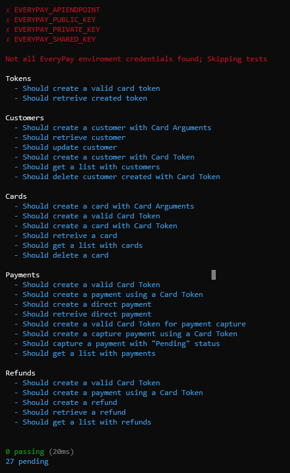

# EveryPay Gateway Bindings Tests

We use [Mocha](https://mochajs.org/) test framework, [Chai](https://www.chaijs.com/) assertion library and [Faker.js](https://github.com/marak/Faker.js/) for generating fake/random data to test each function of the API; These tests cover most use cases but there are no tests for EveryPay predefined scenarios which is a future TODO.

**WARNING**: Run tests only in the sandbox environment (https://sandbox-api.everypay.gr)

**WARNING**: The tests will create users/cards/payments to the sandbox environment that API keys belongs to.

To run the tests, you first have to clone the repo:

```
git clone https://github.com/clytras/everypay.git && cd everypay
```

Then install all dependencies by running `npm install` or `yarn` to the project root directory.

You have to set environment variables using `.env` file (see [installation](../README.md#installation)).

Then run `npm run test` or `yarn test`:


If you don't setup environment variables properly, you'll get a message and all tests will be skipped:


